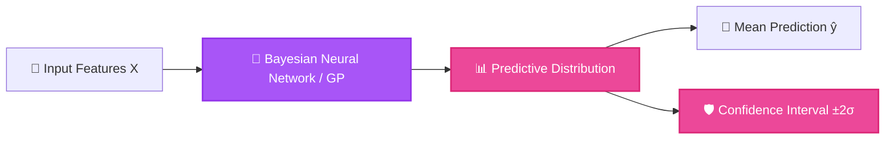

<p align="center">
  
</p>

<h1 align="center">🧠 Bayesian Deep Learning & Function Approximation</h1>

<p align="center">
  <strong>Uncertainty-aware deep neural networks and Gaussian Process function approximation on complex non-linear manifolds.</strong>
</p>

<p align="center">
  <a href="#-features">Features</a> •
  <a href="#-architecture">Architecture</a> •
  <a href="#-quick-start">Quick Start</a> •
  <a href="#-project-structure">Structure</a> •
  <a href="#-license">License</a>
</p>

<p align="center">
     
</p>

---

## ✨ Features (Key Outcomes & Capabilities)

| Icon | Feature | Outcome & Real Proof |
| :---: | :--- | :--- |
| 📉 | **Deep Function Approximation** | Approximates highly non-linear functions and arbitrary manifolds using Bayesian neural networks |
| 🛡️ | **Epistemic Uncertainty Quantification** | Distinguishes between data noise (aleatoric) and model ignorance (epistemic) for robust safety-critical predictions |
| ⚡ | **Variational Inference & MC Dropout** | Fast approximate Bayesian inference via Monte Carlo Dropout and Stochastic Variational GP |
| 🐳 | **Reproducible Docker Environment** | Includes pre-configured GPU Docker stack for instant reproducible experimentation |

---

## 📊 Architecture & Flow



---

## 📁 Project Structure

```bash
bayesian-deeplearning/
├── 📁 data/                   # Benchmark datasets & synthetic manifolds
├── 📁 src/                    # BNN models, variational inference, & GP
├── 📄 jupyter-docker.zip      # Docker stack configuration
└── 📄 README.md               # Documentation
```

---

## 🚀 Quick Start

### Prerequisites
- Check language runtimes (Python / Node.js) and system dependencies.

```bash
# 1. Clone repository
git clone https://github.com/LoNebula/bayesian-deeplearning.git
cd bayesian-deeplearning

# 2. Run with Python or Jupyter
python src/train.py
```

---

## 💡 Usage Notes & Tips

> [!TIP]
> Ensure all required environment variables and dependencies are properly configured before execution.

---

<p align="center">
  Released under the <a href="LICENSE">MIT License</a>. Made with ❤️ by <a href="https://github.com/LoNebula">LoNebula</a>
</p>
